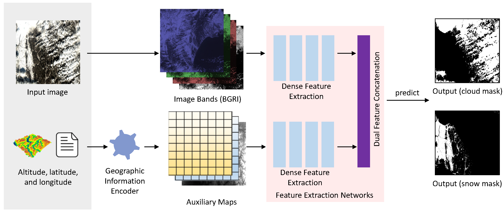

# GeoInfoNet
Code and Dataset information on the paper "A Geographic Information-driven Method and A New Large Scale Dataset for Remote Sensing Cloud/Snow Detection" (ISPRS).

## Overview
In this paper, a novel deep learning based method is proposed for cloud and snow detection. The method is called as Geographic Information-driven Neural Networks (GeoInfoNet). Different from the previous methods that simply focus on using image data (band reflectance) while ignoring geographic information, in the method, a ``geographic information encoder'' is designed, which encodes the altitude, latitude, and longitude of an image into a set of 2D maps. These maps are then integrated pixel-wisely to the detection networks and then train the whole detection model in an end-to-end fashion. It can be observed that the consistent improvement of the cloud and snow detection accuracy with the integration of the auxiliary information. The method outperforms other state of the art cloud and snow detection methods with a large margin. In addition to the new detection framework, a large dataset is also built for cloud and snow detection, which consists of 4,168 images of the Gaofen-1 satellite and is over 20 times larger than other datasets of this field. More importantly, the dataset contains the corresponding geographic information, including the longitude, latitude, and the high-resolution altitude map of each image.  
  
Fig. Overview of the proposed method GeoInfoNet.  

## Dataset Access
Levir_CS(34.42G with 7z format) is available in BaiduDisk: [BaiduDisk](https://pan.baidu.com/s/1AMf9_7RYZyGHDTQcGfFLHA) (extracting code：bf1v)  
Levir_CS(5182.9G) full resolution is also available in BaiduDisk: [BaiduDisk](https://pan.baidu.com/s/1YDgwGJ9ZTVvDNq-iEnh5ZA) (extracting code：2zyi)  

## Requirements
* Python 3.6
* Pytorch 1.0+ & CUDA&CUDNN with corresponding version
* OpenCV 3+
* GDAL 2+

## Setup
1.Clone this repository.  
```
git clone https://github.com/permanentCH5/GeoInfoNet
cd GeoInfoNet
```
2.Download the proposed dataset Levir_CS and unzip it.  
3.Prepare the models. They are available on BaiduDisk:[BaiduDisk](https://pan.baidu.com/s/16C1L3CuqcP0rG0WbXU4qYA ) (extracting code: 30ue). We recommend you to put these models in the folder 'models'.  
For training, the pre-trained model "densenet169.pth" is recommended to use. It is the same with the model in [Pytorch](https://pytorch.org/vision/stable/_modules/torchvision/models/densenet.html#densenet169).  
For testing, the model "gin.pth" can be used in cloud and snow detection.  
4.Before training the model, please modify the contents in "train_levir_cloud_snow_dataset_version3_withdem.txt" in the folder "train" by replacing "/YOUR_DATASET_PATH/" to the real absolute path. Then run the following code to start training the model.
```
cd train
python3 train_gin.py
```
5.Before testing, please modify the contents in "test_levir_cloud_snow_dataset_version3_withdem.txt" in the folder "train" by replacing "/YOUR_DATASET_PATH/" to the real absolute path. Then run the following code to detect the cloud and snow of the images.
```
cd test
python3 test_gin.py
```

## Citation
```
@article{WU202187,
title = {A geographic information-driven method and a new large scale dataset for remote sensing cloud/snow detection},
journal = {ISPRS Journal of Photogrammetry and Remote Sensing},
volume = {174},
pages = {87-104},
year = {2021},
issn = {0924-2716},
doi = {https://doi.org/10.1016/j.isprsjprs.2021.01.023},
url = {https://www.sciencedirect.com/science/article/pii/S0924271621000290},
author = {Xi Wu and Zhenwei Shi and Zhengxia Zou},
}
```
